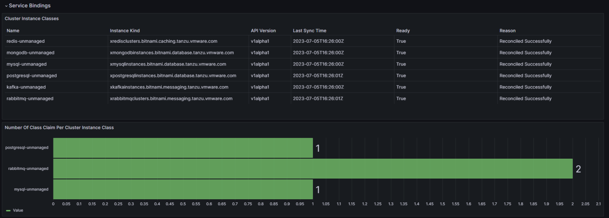

Monitoring  With Prometheus And Grafana

KSM is typically used to pull data from the status fields and specs of common kubernetes resources, and to convert them into metrics which can be scraped by prometheus.

KSM now includes the ability to define a config file with the desired mapping of resource fields to metric labels and values for any Custom Resources, and it will be able to provide us metrics for them as well!

With this in mind, I decided to perform a small POC of building out a monitoring suite for TAP, using KSM.

For this setup i decided to use the kube-prometheus-stack helm chart which makes deploying a fully functional Prometheus and Grafana stack as easy as it gets, and then extend the configuration to support the TAP CRDs, and generate the needed metrics.

For this initial POC i decided to focus on a subset of the TAP resources.

The resource types and corresponding prometheus metrics being monitored are:

workloads – cartographer_workload_info , cartographer_workload_status
deliverables – cartographer_deliverable_info , cartographer_deliverable_status
service bindings – service_binding_info, service_binding_status
cluster instance classes – stk_cluster_instance_class_composition_selector, stk_cluster_instance_class_status
class claims – stk_class_claim_info , stk_class_claim_status
resource claims – stk_resource_claim_info, stk_resource_claim_status
knative services – knative_service_info, knative_service_status
knative revisions – knative_revision_info, knative_revision_status
kapp controller package repositories – carvel_packagerepository_info
kapp controller package installations – carvel_packageinstall_info
kapp controller apps – carvel_app_info, carvel_app_namespaces
api descriptors – api_descriptor_info, api_descriptor_status
tekton pipeline runs – tekton_pipeline_run_info, tekton_pipeline_run_status
tekton task runs – tekton_task_run_info, tekton_task_run_status
accelerators – accelerator_info, accelerator_imports_info, accelerator_status
fragments – accelerator_fragment_info, accelerator_fragment_status
flux git repositories – flux_git_repository_info, flux_git_repository_status
image scans – scst_image_scan_info, scst_image_scan_status
source scans – scst_source_scan_info, scst_source_scan_status
kpack images – kpack_image_info, kpack_image_status
kpack builds – kpack_build_info, kpack_build_involved_buildpacks, kpack_build_status
With these resources and metrics defined I was able to create a simple yet very powerful dashboard in Grafana for visualizing the state of my TAP environment.

First we can show the status of out package installations

We can then show the status of our workloads and some data about them, including which workloads are utilizing the live update and remote debugging features which is a great piece of data to see how your developers are utilizing the platform!

We can then show details about our Flux Source Controller resources

And then we can deep dive into TBS metrics including things like how many workloads are using different buildpacks!

We can also show image scanning results and statistics

We can also show details about Knative configurations as well

We then can look into application accelerators and their status in our environment, as well as API descriptors which are registered

CD is also important so we can also see the details and metrics about our deliverables

And finally we can dig into the service bindings and Services Toolkit resources providing backing services to our workloads!

As you can tell, with just this YAMl configuration, and without a single line of code, the options are endless!!

While this is currently in a POC state, I believe it shows a true potential and already provides value when operating a TAP environment.

